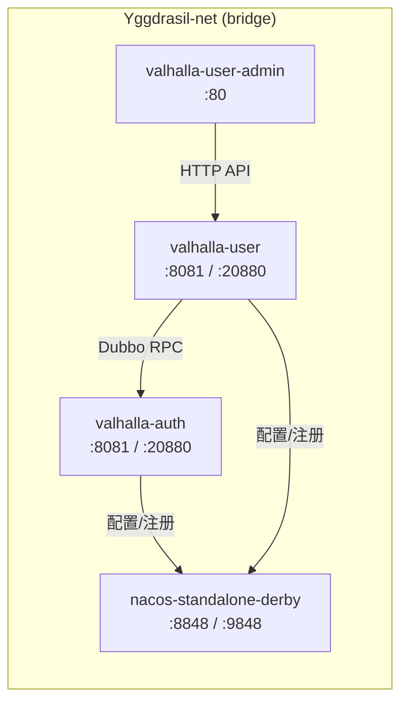

# ARCHITECTURE.md

<!--!
  长期稳定架构约束——系统边界、分层、核心依赖方向。
  修改本文件应走独立的架构 RFC（docs/design-docs/arch-*.md）。
  智能体在开始任何编码任务前应先阅读此文件。
-->

## 系统概述

nidhogg-orchestration 是 Yggdrasil-Labs 生态的基础设施编排项目，为 Valhalla 平台提供统一的 Docker Compose 部署方案。项目本身不包含应用代码，仅定义服务编排、网络拓扑和多环境配置。

当前编排的服务：Nacos（配置中心 & 服务注册）、valhalla-auth（认证微服务）、valhalla-user（用户管理微服务）、valhalla-user-admin（管理后台前端）。所有服务通过 `Yggdrasil-net` bridge 网络通信。

部署模型：Docker Compose 多文件覆盖（base + override），通过 env 文件实现同一 compose 定义多环境复用（dev / test / prod）。

## 项目结构

```
nidhogg-orchestration/
├── docker/
│   ├── docker-compose.yml              # 基础编排定义（服务、网络、卷）
│   ├── README.md                       # Docker 部署说明
│   ├── dev/                            # 开发环境
│   │   ├── docker-compose.override.yml # 开发覆盖（调试端口、Nacos 控制台暴露）
│   │   ├── env                         # 开发环境变量
│   │   ├── start.sh                    # Linux 启动脚本
│   │   └── start.ps1                   # Windows 启动脚本
│   ├── test/                           # 测试环境
│   │   ├── docker-compose.override.yml # 测试覆盖（内部暴露端口）
│   │   ├── env                         # 测试环境变量
│   │   └── start.ps1                   # Windows 启动脚本
│   ├── prod/                           # 生产环境
│   │   ├── docker-compose.override.yml # 生产覆盖（资源限制、安全配置）
│   │   ├── env                         # 生产环境变量
│   │   └── start.ps1                   # Windows 启动脚本
│   └── logs/                           # 服务日志挂载目录（gitignore）
│       ├── valhalla-auth/
│       └── valhalla-user/
├── AGENTS.md                           # 智能体入口
├── ARCHITECTURE.md                     # 本文件
├── README.md                           # 项目说明
├── .gitignore
└── docs/                               # 项目文档
    ├── active/                         # 活跃版本追踪
    ├── archive/                        # 历史版本归档
    └── design-docs/                    # 架构设计决策
```

## 编排服务

| 服务 | 镜像 | 端口（宿主机） | 职责 |
|------|------|----------------|------|
| nacos-standalone-derby | `nacos/nacos-server:v3.0.3` | 8848(HTTP) / 9848(gRPC) / 8080(控制台，仅 dev) | 配置中心 + 服务注册发现 |
| valhalla-auth | `ghcr.io/yggdrasil-labs/valhalla-auth:latest` | 8081(HTTP) / 20880(Dubbo) / 5005(调试，仅 dev) | 用户认证、JWT Token 管理 |
| valhalla-user | `yggdrasil-labs/valhalla-user:latest` | 8082(HTTP) / 20881(Dubbo) / 5006(调试，仅 dev) | 用户管理、RBAC 权限体系 |
| valhalla-user-admin | `ghcr.io/yggdrasil-labs/valhalla-user-admin:latest` | 8083(dev) / 8080(test/prod) | 管理后台前端（Nginx 静态） |

## 网络拓扑



**网络规则：**
- 所有服务加入 `Yggdrasil-net` bridge 网络，容器间通过容器名寻址
- 服务内部端口固定（8081/20880/80），宿主机映射端口通过 env 变量控制
- Nacos 控制台端口(8080)仅 dev 环境暴露，test/prod 仅 expose 内部端口

## 多环境配置策略

采用 Docker Compose 多文件覆盖模式：

```
docker-compose -f docker-compose.yml -f {env}/docker-compose.override.yml --env-file {env}/env up -d
```

| 环境 | Spring Profile | 重启策略 | JVM 内存 | 资源限制 | 特殊配置 |
|------|---------------|----------|----------|----------|----------|
| dev | `dev` | `no` | 64m~128m (SerialGC) | 无 | 暴露调试端口(5005/5006)、Nacos 控制台(8080) |
| test | `test` | `unless-stopped` | 128m~256m (SerialGC) | 无 | 内部端口 expose，不暴露调试端口 |
| prod | `production` | `always` | 256m~512m (G1GC) | CPU 2核/内存 1G | deploy.resources 限制，无调试端口 |

**配置分层：**
- `docker-compose.yml`：定义完整服务结构、健康检查、网络、卷、默认环境变量
- `{env}/docker-compose.override.yml`：环境特定的端口映射、资源限制、额外配置
- `{env}/env`：环境变量值（Profile、端口、JVM 参数、Nacos 认证凭证、Dubbo 注册地址）

## 数据持久化

| 卷名 | 挂载目标 | 用途 |
|------|----------|------|
| nacos-data | /home/nacos/data | Nacos 配置持久化（Derby 嵌入式数据库） |
| nacos-logs | /home/nacos/logs | Nacos 日志 |

## 技术栈

| 层级 | 技术 | 版本/备注 |
|------|------|-----------|
| 容器编排 | Docker Compose | v3.8 格式（prod/test override） |
| 配置中心 | Nacos | v3.0.3（standalone + Derby） |
| 容器运行时 | Docker | bridge 网络模式 |
| 部署脚本 | Shell / PowerShell | 跨平台启动脚本 |

## 关键架构决策

详见 [`docs/design-docs/`](./docs/design-docs/)。
